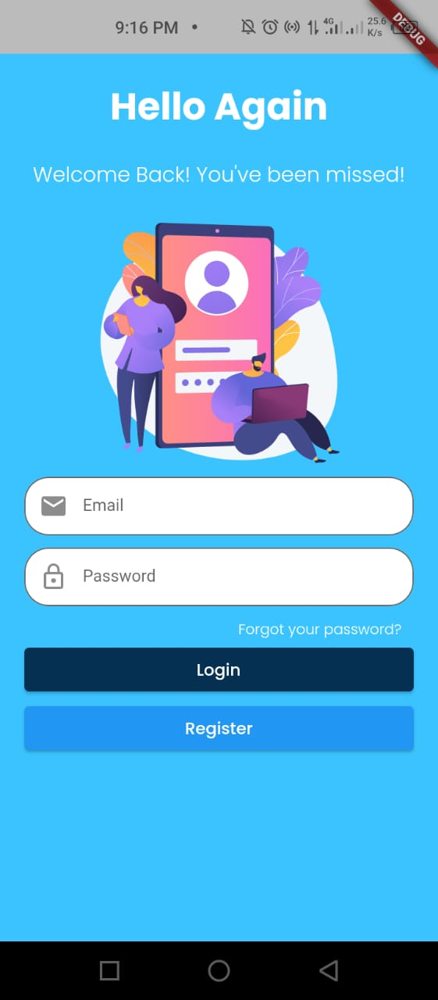
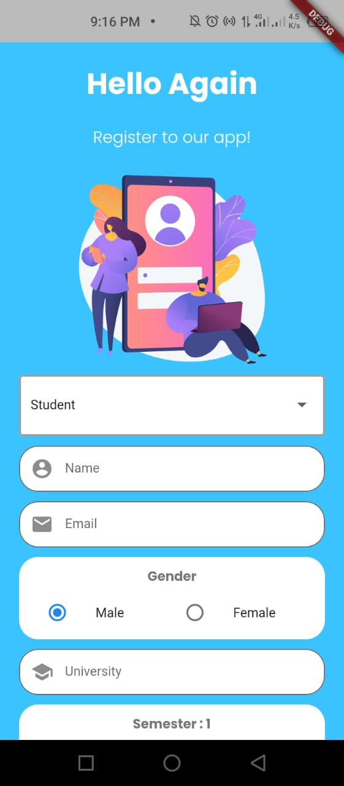
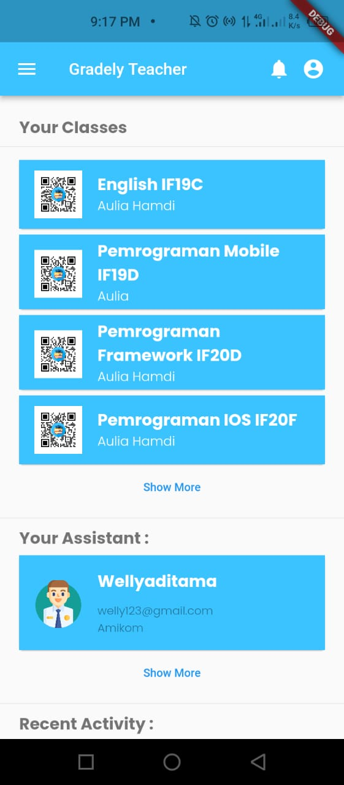
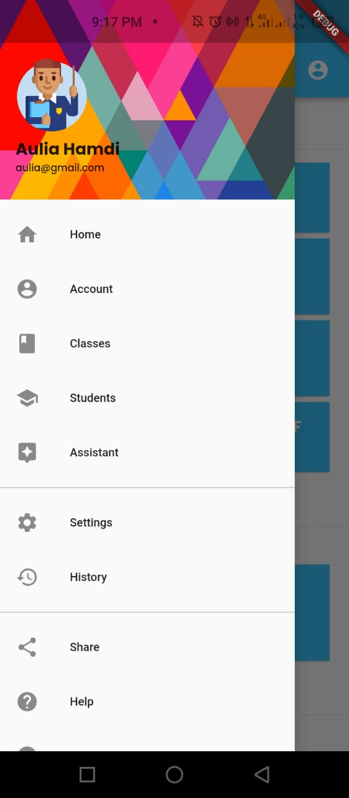
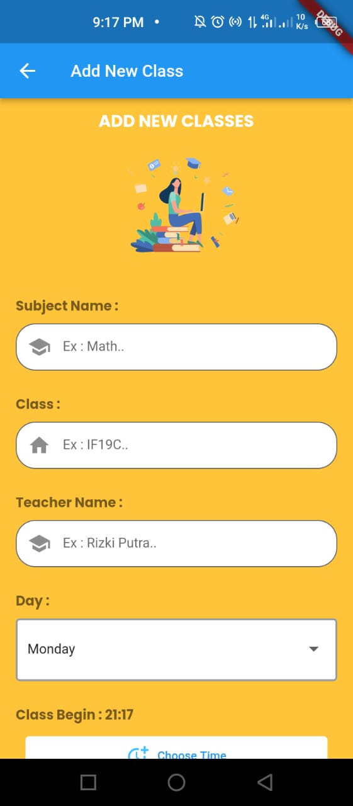
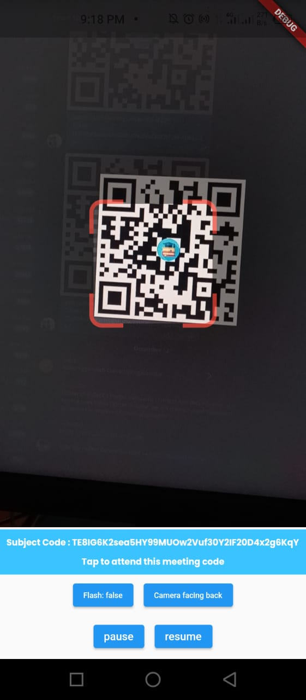
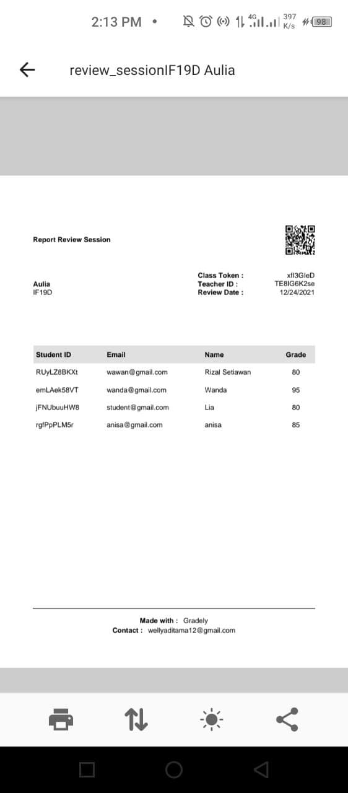

#  Gradely

### 📊 Effective Practicum with QR Code
Cut the long and boring attendance in Practicum Session with this App. 

### 📱 App Features 
- Onboarding Screen
- Reset Password
- Multi-Level Login System
- Online QR Code Attendance
- Add Active Student in the Practicum Session
- Online Grade System for Review Session
- Share QR Code for Classes 
- History
- PDF Report

### 📚 How To Use Gradely
Click this [here](https://drive.google.com/file/d/1fiTxr3nAp2t48iZg3sUcFSEi0Km4KLAk/view?usp=sharing) to download the Gradely App Guide Book

### 📱 App Preview

Splash Screen | Login Page | Register Poll | 
:----------:|:----------:|:----------:|
|||

Home Page | Side Drawer | Add New Classes | 
:----------:|:----------:|:----------:|
|||

Scan QR Code | PDF Report | 
:----------:|:----------:|
||

### ⚡ Acknowledgments
Resource and illustration used on this project:

- 
Icons made by <a href="https://www.freepik.com" title="Freepik">Freepik</a> from <a href="https://www.flaticon.com/" title="Flaticon">www.flaticon.com</a>

- [Undraw](https://undraw.co/), see license [here](https://undraw.co/license)
- [Vexels](https://www.vexels.com/), see license [here](https://www.vexels.com/terms-and-conditions/)

Flutter Package used on this project:

- [firebase_auth](https://pub.dev/packages/firebase_auth/versions/3.2.0)
- [firebase_core](https://pub.dev/packages/firebase_core)
- [provider](https://pub.dev/packages/provider)
- [cloud_firestore](https://pub.dev/packages/cloud_firestore/versions)
- [flutter_spinkit](https://pub.dev/packages/flutter_spinkit)
- [share_plus](https://pub.dev/packages/share_plus)
- [introduction_screen](https://pub.dev/packages/introduction_screen)
- [lottie](https://pub.dev/packages/lottie)
- [animated_text_kit](https://pub.dev/packages/animated_text_kit)
- [animator](https://pub.dev/packages/flutter_animator/versions)
- [shared_preferences](https://pub.dev/packages/shared_preferences)
- [firebase_storage](https://pub.dev/packages/firebase_storage/versions)
- [file_picker](https://pub.dev/packages/file_picker/versions)
- [flutter_datetime_picker](https://pub.dev/packages/flutter_datetime_picker)
- [qr_flutter](https://pub.dev/packages/qr_flutter)
- [path_provider](https://pub.dev/packages/path_provider/versions)
- [qr_code_scanner](https://pub.dev/packages/qr_code_scanner)
- [url_launcher](https://pub.dev/packages/url_launcher/versions)
- [pdf](https://pub.dev/packages/pdf/versions)

### 👨‍💻 Made By : Team CSD - 185
- [Wellyanto Pria Aditama](https://github.com/wellyaditama)
- [Ivana Gabriela Manurung](https://github.com/rzr1991)
 
